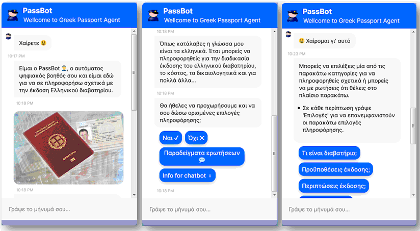

<h1 align="center">PassBot Chatbot 💬</h1>
<h5 align="center">
A Chatbot for greek Passport Issuance <a href="http://195.251.209.218:8000/index.html" target="_blank">PassBot</a>.
</h5>
 
 

# PassBot_project
RASA CHATBOT FOR GREEK PASSPORT ISSUANCE

## Ιntroduction
This chatbot was developed as part of a master's thesis with the topic: 'Chatbot development for passport issuance'.
It was built by Pantelis Antoniadis, master's student of the 'Master in Information Systems' department of the Hellenic Open University (HOU), during the 2019-20 academic year.

*Supervisor: Efthimios Tambouris, teacher at the Department of Applied Informatics of the University of Macedonia (UOM)*

The chatbot application is developed using the Rasa open source framework, while all the relevant passport information is described using the CPSV-AP model,
stored in a MySQL database and retrieved on demand, whenever the bot responds to a user's demand. Both the chatbot and the webpage, which is used to access it in a user-friendly
way, are hosted in one of the servers of the University of Macedonia, kindly given by E. Mamatas, assistant professor at the Department of Applied Informatics, UOM.

The chatbot covers the following needs for information:
- What is a passport?
- Requirements for issuing a passport (briefly/exhaustively)
- Cases of passport issuance
- Cost of passport issuance
- Process of issuing a passport
- List of supporting evidence
- Personalized information on issuing a passport
- Passport offices
- Nearest passport office
- Passport validity period
- Emergent passport issuance
- Passport loss/theft
- Passport cancellation
- Personal data that a passport contains
- Legislation on passports

Directs the user to the corresponding Greek Police website to get info on:
- e-paravolo
- Desired passport photo specs
- Progress of an application for a passport

Sends an email to the user about:
- Personalized evidence, issuance costs
- Process of issuing a passport
- Requirements for issuing a passport
- Passport offices / nearest passport office

It also covers:
- Small talk
- Greetings/thanksgivings
- 'Out of scope' question
- Feedback; When the user says goodbye or thanks the bot, a short feedback session begins

## Installation

Project folders '../passbot_project' :
1. other_files	: Sql scripts for 'cpsv_ap' MySql database and other useful files
2. passbot		: The chatbot's folder
3. webchat		: Chat Widget to deploy virtual assistants made with Rasa

## To create a mysql database:
	In Mysql prompt, run Sql scripts file from 'other_files' folder.

## To run PassBot:
**1.** There are some custom actions that require connections to external services.  
	You would need to have your own Gmail account for passbot.  
	In 'actions.py' file fill the credentials for mysql database and gmail account and save it. 

**2.** Activate virtual environment. 

**3.** cd passbot  
	Use `rasa train` to train a model.  

**4.** Then, use 'rasa run actions' to get up your action server in one terminal window.  

**5.** In another window, run the bot:  
	'rasa shell'  
	Then, talk to the bot in greek.  

**6.** If you would like to run Passbot through the website who created for this purpose, you can use the 'webchat' folder.  
	Replace the command 5 with :  
	**5a.** 'python -m rasa run --m ./models --endpoints endpoints.yml --port 5005 -vv --enable-api --cors "*"'  
	Then from the 'webchat' folder run :  
	**5b.** 'python -m http.server 8000'  
	Run Chatbot from your browser:  
	**5c.** http://Your_web_site:8000/index.html  

   Or you can follow the instructions [here](https://github.com/botfront/rasa-webchat) to place the chat widget on your website.  
	

## Overview of the files

`data/core/` - contains stories 

`data/nlu` - contains NLU training data

`actions` - contains custom action code

`domain.yml` - the domain file, including bot response templates

`config.yml` - training configurations for the NLU pipeline and policy ensemble
